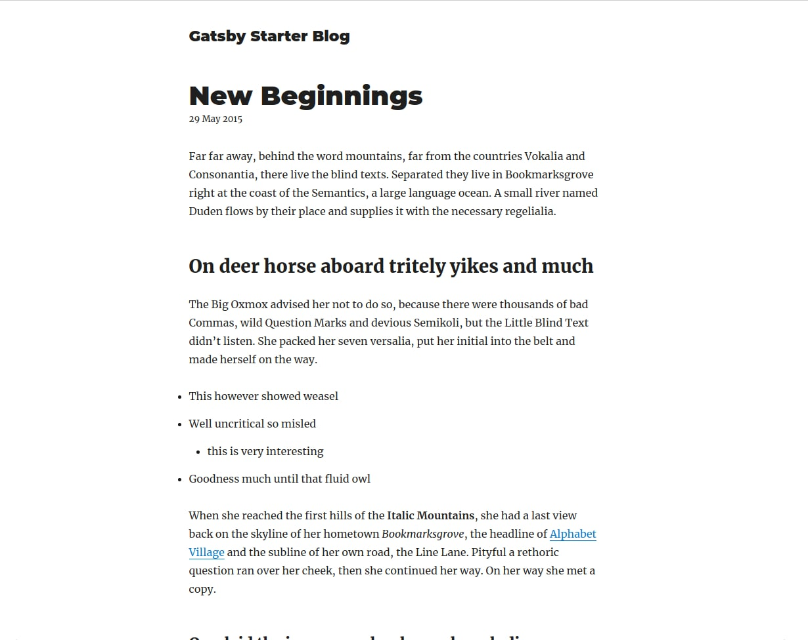
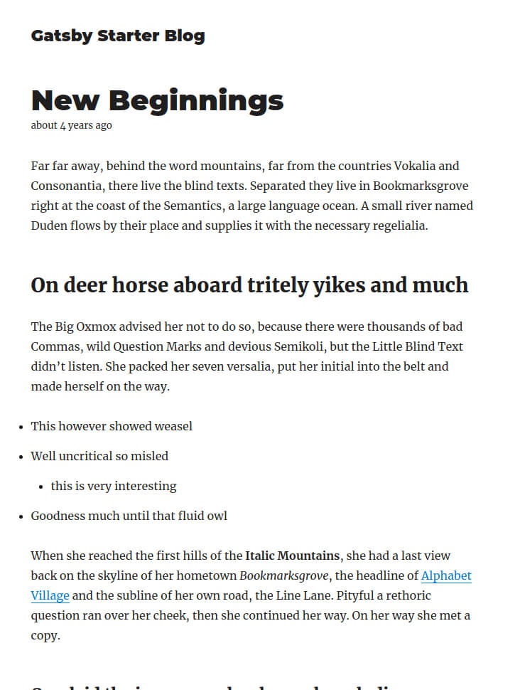

## Introduction

In this blog post we will learn more about [date-fns](https://date-fns.org) and why it is such an amazing date utility
library to manage your dates in JavaScript. We will be using `v2.0.0-alpha.27` but if there is a newer version you can
use that as well. We will be using the [gatsby-starter-blog](https://github.com/gatsbyjs/gatsby-starter-blog) Github
repository as a starting point. At any point you can browse to the final project on Github
[here](https://github.com/Asjas/gatsby-date-fns-starter).

### Why use date-fns?

We have always had the npm package [Moment.js](https://momentjs.com/) as the go-to npm library to manage dates in
JavaScript but as time went on the library grew really large and there were no easy ways to split the library up into
smaller pieces by using code-splitting. Date-fns changes this. Date-fns is very modular, it supports
[tree-shaking](https://webpack.js.org/guides/tree-shaking/) and even supports Internationalization (I18n).

### Getting Started

First things first, you need to create a folder where we will be creating the Gatsby project. _If you already have a
folder where you keep your projects you can use that folder instead._

```bash:title=/
mkdir projects
cd projects
```

Once that has been done we can use [npx](https://www.bram.us/2017/07/15/introducing-npx-an-npm-package-runner/) (not npm
misspelled) to create a new Gatsby project based off the Gatsby Blog Starter Github repository.

```bash:title=/projects/
npx gatsby new gatsby-date-fns-starter https://github.com/gatsbyjs/gatsby-starter-blog
```

When you are asked to choose between `npm` or `yarn` as your package manager you can choose the one you are comfortable
with. In this blog post we will be using `yarn`.

You can now navigate into the new Gatsby directory and start the development server to check if the installation
succeeded.

```bash:title=/projects/
cd gatsby-date-fns-starter
yarn develop
```

This will start a localhost server on `http://localhost:8000`. Open the url in your browser to check if the server has
started correctly. Once you have verified that the server is running we can continue to the next section where we will
be installing `date-fns`.

### Installing date-fns

In the same folder where you started the development server you can run the following command to install `date-fns`. We
will be installing the latest alpha version as this is the version that supports all of the new functions that we will
be using.

Choose one of the package install commands based on the package manager you are using (npm or yarn).

```bash:title=/projects/gatsby-date-fns-starter
npm install date-fns@next --save
yarn add date-fns@next
```

### Using the date-fns format function

Now that we have Gatsby.js and date-fns installed we can now use date-fns to format the dates of our blog posts. You can
open the `gatsby-date-fns-starter` folder in your favorite text editor to continue. In this first example we will be
making the following changes to the code of the `index.js` file.

1. We need to import the format function from date-fns.
2. We need to update the GraphQL query to import date without formatting it beforehand.
3. We pass the date to new Date() as a parameter to create a valid date for the format function.
4. We replace the current date with the format function to create a new formatted date.

```jsx{3,33,64}:title=src/pages/index.js
import React from "react"
import { Link, graphql } from "gatsby"
import { format } from "date-fns";

import Bio from "../components/bio"
import Layout from "../components/layout"
import SEO from "../components/seo"
import { rhythm } from "../utils/typography"

class BlogIndex extends React.Component {
  render() {
    const { data } = this.props
    const siteTitle = data.site.siteMetadata.title
    const posts = data.allMarkdownRemark.edges

    return (
      <Layout location={this.props.location} title={siteTitle}
        <SEO title="All posts" />
        <Bio />
        {posts.map(({ node }) => {
          const title = node.frontmatter.title || node.fields.slug
          return (
            <div key={node.fields.slug}>
               <h3
                style={{
                  marginBottom: rhythm(1 / 4),
                }}
               >
                <Link style={{ boxShadow: `none` }} to={node.fields.slug}>
                  {title}
                </Link>
              </h3>
              <time>{format(new Date(node.frontmatter.date), 'dd MMMM yyyy')}</time>
              <p
                dangerouslySetInnerHTML={{
                  __html: node.frontmatter.description || node.excerpt,
                }}
              />
            </div>
          )
        })}
      </Layout>
    )
  }
}

export default BlogIndex

export const pageQuery = graphql`
  query {
    site {
      siteMetadata {
        title
      }
    }
    allMarkdownRemark(sort: { fields: [frontmatter___date], order: DESC }) {
      edges {
        node {
          excerpt
          fields {
            slug
          }
          frontmatter {
            date
            title
            description
          }
        }
      }
    }
  }
`
```

We will also update the `blog-post.js` file to use the new date-fns format function.

```jsx{3,31,85}:title=src/templates/blog-post.js
import React from 'react';
import { Link, graphql } from 'gatsby';
import { format } from 'date-fns';

import Bio from '../components/bio';
import Layout from '../components/layout';
import SEO from '../components/seo';
import { rhythm, scale } from '../utils/typography';

class BlogPostTemplate extends React.Component {
  render() {
    const post = this.props.data.markdownRemark;
    const siteTitle = this.props.data.site.siteMetadata.title;
    const { previous, next } = this.props.pageContext;

    return (
      <Layout location={this.props.location} title={siteTitle}>
        <SEO title={post.frontmatter.title} description={post.frontmatter.description || post.excerpt} />
        <h1>{post.frontmatter.title}</h1>
        <p
          style={{
            ...scale(-1 / 5),
            display: `block`,
            marginBottom: rhythm(1),
            marginTop: rhythm(-1),
          }}
        >
          <time>{format(new Date(post.frontmatter.date), 'dd MMMM yyyy')}</time>
        </p>
        <div dangerouslySetInnerHTML={{ __html: post.html }} />
        <hr
          style={{
            marginBottom: rhythm(1),
          }}
        />
        <Bio />

        <ul
          style={{
            display: `flex`,
            flexWrap: `wrap`,
            justifyContent: `space-between`,
            listStyle: `none`,
            padding: 0,
          }}
        >
          <li>
            {previous && (
              <Link to={previous.fields.slug} rel="prev">
                ← {previous.frontmatter.title}
              </Link>
            )}
          </li>
          <li>
            {next && (
              <Link to={next.fields.slug} rel="next">
                {next.frontmatter.title} →
              </Link>
            )}
          </li>
        </ul>
      </Layout>
    );
  }
}

export default BlogPostTemplate;

export const pageQuery = graphql`
  query BlogPostBySlug($slug: String!) {
    site {
      siteMetadata {
        title
        author
      }
    }
    markdownRemark(fields: { slug: { eq: $slug } }) {
      id
      excerpt(pruneLength: 160)
      html
      frontmatter {
        title
        date
        description
      }
    }
  }
`;
```

You can checkout a copy of this code [here](https://github.com/Asjas/gatsby-date-fns-starter/tree/format-function) on
the `format-function` branch if you need to compare your code.

If everything went great and you are not receiving any error messages you should see the dates render on the homepage
the same as it did before we used date-fns. This is how it should look when it is working.

#### Blog Post Page (format function)



You might be wondering why would need to use date-fns to only have the same result as we had before we started using it.
The power comes with what date-fns allows us to do when formatting the date. Here are a few examples of different format
parameters that you can pass to the `format` function and the output you would receive.

```js:title=index.js
format(new Date(node.frontmatter.date), 'dd MMMM');
// 29 May

format(new Date(node.frontmatter.date), 'dd-MM-yyyy');
// 29-05-2015

format(new Date(node.frontmatter.date), 'dd MMMM yyyy', { locale: ru });
// 29 мая 2015
```

If you want to format dates using different locales you need to import the specific locale into the file to be able to
use it. You can read more about this on the date-fns [documentation](https://date-fns.org/v2.0.0-alpha.27/docs/I18n)
website about Internationalization. The best part about date-fns is that because it is modular and uses pure functions
only the functions and locales you import into a file will be included. This keeps your JavaScript bundles small.

### Using the date-fns formatDistance function

The next date-fns function I am going to show you is called `formatDistance`. This is personally my favorite date-fns
function. This function does not return the actual date but rather a relative distance described in words. The date-fns
`formatDistance` function is also different to the `format` in that it calculates the difference between 2 dates
supplied as arguments to the function. You can also supply a `suffix` option to the function.

We are going to use the same `index.js` file as the first code example but we will be swopping out `format` with the
`formatDistance` function.

```jsx{3,33,64}:title=src/pages/index.js
import React from 'react';
import { Link, graphql } from 'gatsby';
import { formatDistance } from 'date-fns';

import Bio from '../components/bio';
import Layout from '../components/layout';
import SEO from '../components/seo';
import { rhythm } from '../utils/typography';

class BlogIndex extends React.Component {
  render() {
    const { data } = this.props;
    const siteTitle = data.site.siteMetadata.title;
    const posts = data.allMarkdownRemark.edges;

    return (
      <Layout location={this.props.location} title={siteTitle}>
        <SEO title="All posts" />
        <Bio />
        {posts.map(({ node }) => {
          const title = node.frontmatter.title || node.fields.slug;
          return (
            <div key={node.fields.slug}>
              <h3
                style={{
                  marginBottom: rhythm(1 / 4),
                }}
              >
                <Link style={{ boxShadow: `none` }} to={node.fields.slug}>
                  {title}
                </Link>
              </h3>
              <time>{formatDistance(new Date(node.frontmatter.date), new Date(), { addSuffix: true })}</time>
              <p
                dangerouslySetInnerHTML={{
                  __html: node.frontmatter.description || node.excerpt,
                }}
              />
            </div>
          );
        })}
      </Layout>
    );
  }
}

export default BlogIndex;

export const pageQuery = graphql`
  query {
    site {
      siteMetadata {
        title
      }
    }
    allMarkdownRemark(sort: { fields: [frontmatter___date], order: DESC }) {
      edges {
        node {
          excerpt
          fields {
            slug
          }
          frontmatter {
            date
            title
            description
          }
        }
      }
    }
  }
`;
```

We will make the same changes to the blog post page.

```jsx{3,31,85}:title=src/templates/blog-post.js
import React from 'react';
import { Link, graphql } from 'gatsby';
import { formatDistance } from 'date-fns';

import Bio from '../components/bio';
import Layout from '../components/layout';
import SEO from '../components/seo';
import { rhythm, scale } from '../utils/typography';

class BlogPostTemplate extends React.Component {
  render() {
    const post = this.props.data.markdownRemark;
    const siteTitle = this.props.data.site.siteMetadata.title;
    const { previous, next } = this.props.pageContext;

    return (
      <Layout location={this.props.location} title={siteTitle}>
        <SEO title={post.frontmatter.title} description={post.frontmatter.description || post.excerpt} />
        <h1>{post.frontmatter.title}</h1>
        <p
          style={{
            ...scale(-1 / 5),
            display: `block`,
            marginBottom: rhythm(1),
            marginTop: rhythm(-1),
          }}
        >
          <time>{formatDistance(new Date(post.frontmatter.date), new Date(), { addSuffix: true })}</time>
        </p>
        <div dangerouslySetInnerHTML={{ __html: post.html }} />
        <hr
          style={{
            marginBottom: rhythm(1),
          }}
        />
        <Bio />

        <ul
          style={{
            display: `flex`,
            flexWrap: `wrap`,
            justifyContent: `space-between`,
            listStyle: `none`,
            padding: 0,
          }}
        >
          <li>
            {previous && (
              <Link to={previous.fields.slug} rel="prev">
                ← {previous.frontmatter.title}
              </Link>
            )}
          </li>
          <li>
            {next && (
              <Link to={next.fields.slug} rel="next">
                {next.frontmatter.title} →
              </Link>
            )}
          </li>
        </ul>
      </Layout>
    );
  }
}

export default BlogPostTemplate;

export const pageQuery = graphql`
  query BlogPostBySlug($slug: String!) {
    site {
      siteMetadata {
        title
        author
      }
    }
    markdownRemark(fields: { slug: { eq: $slug } }) {
      id
      excerpt(pruneLength: 160)
      html
      frontmatter {
        title
        date
        description
      }
    }
  }
`;
```

You can checkout a copy of this code [here](https://github.com/Asjas/gatsby-date-fns-starter/tree/format-distance) on
the `format-distance` branch if you need to compare your code. This is how it should appear on your screen when it is
working correctly.

#### Blog Post Page (formatDistance function)



Here are a few examples of what you can do with the `formatDistance` function. Something to take note of, if you want to
calculate the difference between dates with the `formatDistance` function you have to first pass the previous date and
then the current date as parameters to the function.

```js:title=index.js
<time>{formatDistance(new Date(node.frontmatter.date), new Date())}</time>
// about 4 years

<time>{formatDistance(new Date(node.frontmatter.date), new Date(), { addSuffix: true })}</time>
// about 4 years ago

<time>{formatDistance(new Date(node.frontmatter.date), new Date(), { addSuffix: true, locale: ru })}</time>
// около 4 лет назад

<time>{formatDistance(new Date(node.frontmatter.date), new Date(), { addSuffix: true, locale: eo })}</time>
// antaŭ proksimume 4 jaroj
```

I am also linking to the [date-fns](https://date-fns.org/v2.0.0-alpha.27/docs/Getting-Started) website so that you can
read more about the different use cases of the `format` and `formatDistance` functions as well as many of the other
functions and features that they support.

Found a issue or have any recommendations? Please open an issue
[here](https://github.com/Asjas/Personal-Website/issues).
